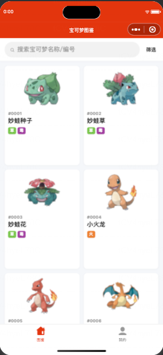
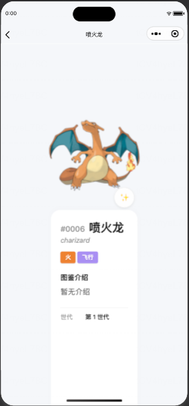
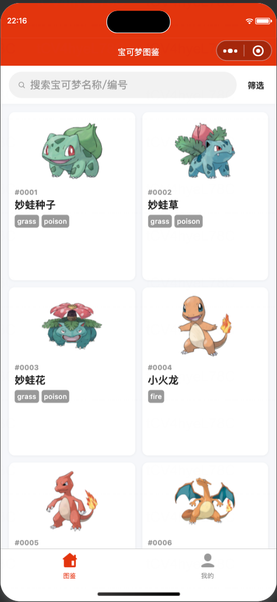
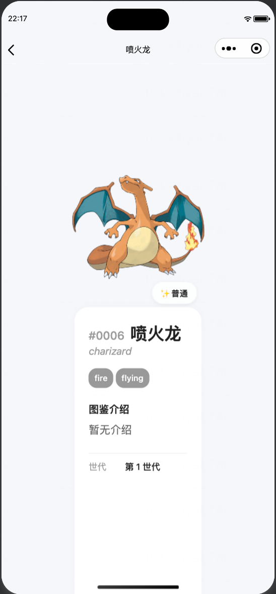
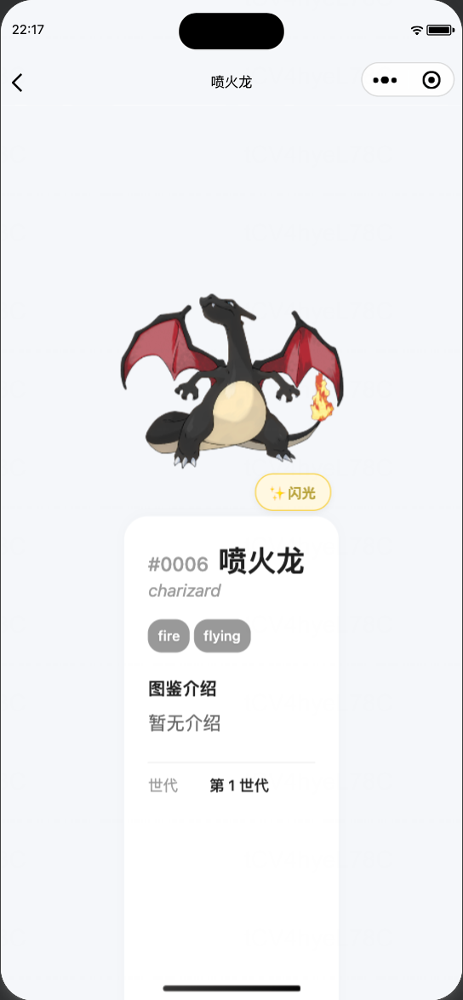

# 宝可梦图鉴小程序 (Pokemon Pokedex)

## 📌 项目简介
一款专为宝可梦爱好者打造的微信小程序图鉴工具。致力于提供最全、最快、最便捷的宝可梦数据查询体验。
无需下载 App，即开即用，覆盖 Gen 1 ~ Gen 9 全世代宝可梦数据。

## 🚀 功能迭代 (Version History)

### v1.0 (MVP) - 2026/01
**核心目标**：基础图鉴查询与形态展示。

*   **全世代收录**：完整覆盖 #0001 ~ #1025 只宝可梦的基础数据（编号、名称、属性）。
*   **高清图鉴**：
    *   **双形态切换**：支持“普通”与“闪光”形态的一键切换展示。
    *   **大图预览**：点击查看高清立绘。
*   **多维检索**：
    *   **筛选**：支持按 **世代** (Gen1-9) 和 **属性** (火/水/草等) 进行筛选。
    *   **搜索**：支持 **中文名**、**英文名** 和 **图鉴编号** 精确查找。
*   **用户系统**：
    *   基础注册/登录功能。
    *   个人中心页面（包含退出登录）。

### v1.1 (体验优化) - 2026/01
**核心目标**：视觉与交互细节打磨。

*   **UI 升级**：
    *   **属性标签**：全面适配 18 种官方属性色，优化视觉层级。
    *   **闪光按钮**：全新设计的悬浮式 ✨ 按钮，提升“闪光”状态的尊贵感。
*   **交互优化**：
    *   **形态切换**：新增 Cross-fade 渐变动效，告别生硬跳变。

## 📸 界面预览 (Screenshots)

### v1.1（2026.01.13）
| 首页 (属性标签优化) | 详情页 (闪光按钮升级) | 闪光态 (动效/高亮) |
| :---: | :---: | :---: |
|  |  |  |

### v1.0（2026.01.11）
| 首页 / 图鉴列表 | 搜索功能 |
| :---: | :---: |
|  |  |

| 详情页 (普通形态) | 详情页 (闪光形态) |
| :---: | :---: |
|  |  |

## 🛠 技术栈
*   **前端**：微信小程序原生开发 (WXML, WXSS, JS/TS)
*   **数据源**：参考 52poke Wiki

## 📂 目录结构
*   `docs/` - 产品与设计文档
    *   `v1.0/` - v1.0 版本文档
    *   `v1.1/` - v1.1 版本文档
*   `miniprogram/` - 小程序源码
