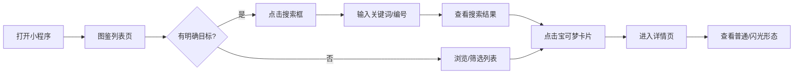
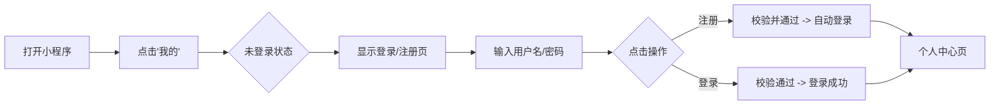

# 宝可梦图鉴小程序产品需求文档 (PRD)

| 文档版本 | 修改日期 | 修改人 | 修改内容 |
| :--- | :--- | :--- | :--- |
| v1.0 | 2026-01-11 | Antigravity | 初稿创建 |

## 1. 业务目标与核心用户价值

### 1.1 业务目标
*   **填补市场空白**：打造一款移动端体验优秀、无需下载、即用即走的宝可梦图鉴微信小程序，解决玩家在手机端查询图鉴不便的问题。
*   **流量获取**：通过高频查询的工具属性吸引宝可梦粉丝，沉淀基础用户流量。
*   **用户沉淀**：通过注册登录功能，建立用户账户体系，为后续拓展功能（如收藏、队伍构建、伤害计算）奠定基础。

### 1.2 核心用户价值
*   **便捷查询**：相比网页Wiki，小程序加载更快，交互更符合手机操作习惯，随时随地可查。
*   **数据全面**：覆盖第1-9世代共1025只宝可梦数据，满足核心玩家需求。
*   **形态展示**：直观展示宝可梦的普通形态与闪光形态，满足“闪光党”的收集比对需求。
*   **中英对照**：提供中英文名称对照，方便玩家在不同语言版本的游戏/社区中对应。

---

## 2. 功能模块清单

| 模块 | 功能点 | 优先级 | 功能描述 | 用户用例 (User Story) |
| :--- | :--- | :--- | :--- | :--- |
| **图鉴列表** | 列表展示 | **P0** | 展示宝可梦列表，包含缩略图、编号、中文名、属性。 | 作为用户，我想浏览所有宝可梦，以便快速查看图鉴概览。 |
| | 筛选查询 | **P0** | 支持按“世代”、“属性”（单/双属性）进行筛选。 | 作为用户，我想筛选出“第一世代”的“火属性”宝可梦，以便缩小查找范围。 |
| | 搜索功能 | **P0** | 支持按“中文名”、“英文名”、“全国图鉴编号”搜索。 | 作为用户，我想输入“皮卡丘”或“0025”，以便直接找到特定宝可梦。 |
| **图鉴详情** | 基础信息 | **P0** | 展示编号、中英文名、属性、来源世代。 | 作为用户，我想查看详细信息，了解这只宝可梦的基本资料。 |
| | 形象展示 | **P0** | 展示高画质大图，支持点击/滑动切换“普通形态”和“闪光形态”。 | 作为用户，我想看这只宝可梦的闪光样子，以便决定是否去刷闪。 |
| **用户系统** | 注册 | **P1** | 用户名、密码注册。 | As a new user, I want to register an account. |
| | 登录 | **P1** | 用户名、密码登录。 | As a user, I want to login to access my personalized data. |
| | 个人中心 | **P2** | 展示用户信息，退出登录入口。 | As a user, I want to manage my account or log out. |

---

## 3. 用户流程与场景 (User Flow)

### 3.1 游客浏览图鉴流程


### 3.2 用户注册/登录流程


---

## 4. PRD 详细需求

### 4.1 图鉴列表页 (Home)
*   **页面标题**：宝可梦图鉴
*   **顶部栏**：
    *   **搜索框**：Placeholder提示“搜索宝可梦名称/编号”。
    *   **筛选按钮**：点击弹出底部抽屉，选项包括：
        *   世代：全部, Gen 1 ~ Gen 9
        *   属性：一般, 火, 水, 草, 电, 等18种属性 (支持多选或单选，初期建议单选)。
*   **列表内容**：
    *   采用 Grid 布局或 List 布局（建议 Grid，一行2个，图多字少）。
    *   **卡片内容**：
        *   宝可梦图片 (普通形态缩略图)
        *   编号 (e.g., #0025)
        *   中文名称
        *   属性图标/标签 (e.g., [电])
*   **交互逻辑**：
    *   下拉刷新：更新数据。
    *   触底加载：分页加载，每页 20-50 条，显示 Loading Spinner 或骨架屏。
    *   点击卡片：跳转至详情页。
    *   筛选交互：点击顶部筛选图标 -> 弹出底部菜单 -> 选择条件 -> 点击“确定”按钮触发筛选（非实时刷新）。

### 4.2 图鉴详情页 (Detail)
*   **顶部导航**：返回按钮，标题为宝可梦中文名。
*   **核心区域**：
    *   **大图展示**：居中展示宝可梦立绘，背景统一使用浅灰色 (#F5F7FA) 或品牌淡红，不随属性变色。
    *   **形态切换**：提供 Switch 或 Tab 或 图片点击交互，切换 `Default` / `Shiny` (闪光)。切换时直接替换图片或使用简单淡入淡出，无复杂 3D 翻转动画。
*   **信息区域**：
    *   **编号**：#XXXX
    *   **名称**：中文名 | English Name
    *   **属性**：展示属性图标（如 火+飞行）。
    *   **世代**：标记“第X世代引入”。
*   **数据来源**：页面底部注明“数据来源：52poke Wiki”。

### 4.3 注册/登录页 (Auth)
*   **入口**：列表页底部 TabBar 的“我的”或侧边栏入口。
*   **输入项**：
    *   用户名 (Input): 限制 4-20 字符。
    *   密码 (Input): 密码类型，建议限制 6-20 字符。
*   **操作按钮**：
    *   “登录” (Primary Button)
    *   “注册” (Secondary Button / Link text)
*   **反馈**：
    *   Loading 提示。
    *   错误提示 (Toast): “用户名已存在”、“密码错误”等。

### 4.4 数据需求 (Schema)
你需要准备一个 JSON 数据库或云开发数据库，结构参考：
```json
{
  "id": 25,
  "name_zh": "皮卡丘",
  "name_en": "Pikachu",
  "gen": 1,
  "types": ["Electric"],
  "image_normal": "url_to_normal_img",
  "image_shiny": "url_to_shiny_img",
  "desc": "..."
}
```

### 4.5 验收标准 (Acceptance Criteria)
1.  **完整性**：必须包含 #0001 到 #1025 所有宝可梦的基础数据（至少包含图、名、属性）。
2.  **准确性**：宝可梦的属性、中英文名与官方/Wiki一致。
3.  **性能**：列表页滚动流畅，图片加载支持懒加载或占位图。
4.  **功能**：普通/闪光形态切换响应迅速；筛选和搜索结果准确无误。
5.  **账号**：不同账号注册不能重名；登录后状态持久化存储 (Storage)。
